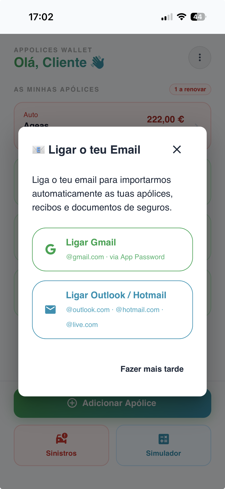
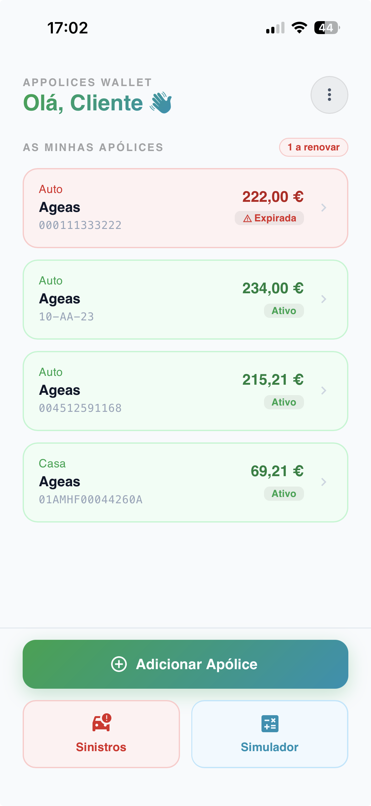
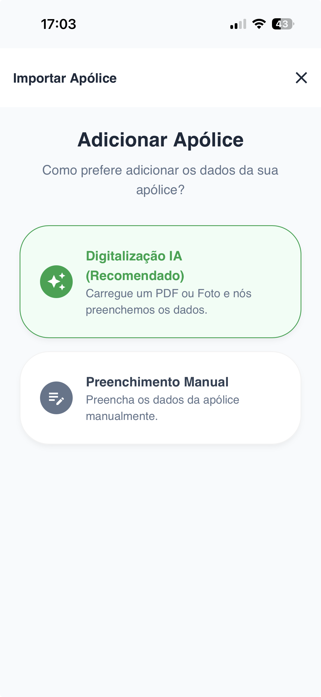
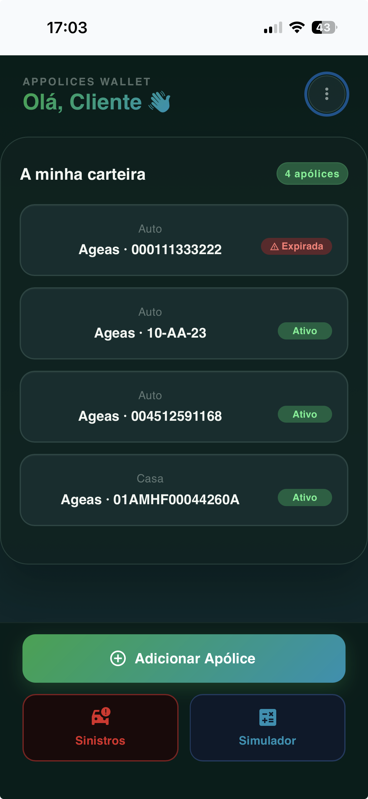

# appolices-wallet-showcase
Insurance policy management PWA — built with React, Strapi, PostgreSQL and OpenAI Vision

🛡️ Apólices Wallet

> **A smart insurance policy management PWA for Portuguese insurance brokers and their clients.**

[](https://wallet.appolices.pt)
[](https://reactjs.org)
[](https://strapi.io)
[](https://neon.tech)
[](https://openai.com)

---

## 📌 Overview

**Apólices Wallet** is a full-stack Progressive Web App that centralises insurance policy management for Portuguese insurance brokers and their clients. The platform automates policy ingestion through AI-powered OCR, supports multi-provider email scanning, and generates legally compliant PDF documents — all within a mobile-first experience.

The project is built and operated as a solo developer-entrepreneur effort, combining real-world brokerage practice (ASF registration nº 322575544) with a production SaaS platform.

---

## ✨ Key Features

- 📧 **Email Scanner** — connects to Gmail and Outlook via OAuth, scans inbox for insurance documents using IMAP with batched processing to avoid memory limits
- 🤖 **AI-Powered OCR** — extracts policy data from PDF attachments using OpenAI GPT-4o Vision, with a human-review confirmation flow before saving
- 📄 **Policy Management** — full CRUD for insurance policies across multiple categories (auto, health, home, life, etc.)
- 📑 **Legal PDF Generation** — auto-generates mediation transfer and cancellation letters compliant with Portuguese insurance law (DL 72/2008, DL 109-D/2021, ASF Circular 3/2016)
- 🔐 **OAuth Authentication** — Gmail and Outlook OAuth2 flows for secure email access
- 📱 **PWA** — installable on Android and iOS, works offline, deployed to Google Play
- 🌙 **Dark / Light Theme** — full Material UI theming with user preference persistence
- ✉️ **Transactional Email** — policy import confirmations, transfer notifications, and multi-recipient flows via Resend

---

## 📸 Screenshots

<div align="center">
  
  
  
  
  
</div>


---
## 🛠️ Tech Stack

| Layer | Technology |
|---|---|
| **Frontend** | React 18, Vite, Material UI, React Router |
| **Backend** | Strapi v5 (Node.js), custom controllers & services |
| **Database** | PostgreSQL via Neon (serverless) |
| **File Storage** | Cloudinary |
| **Email** | Resend (`strapi-provider-email-resend`) |
| **AI / OCR** | OpenAI GPT-4o Vision API |
| **Auth** | Gmail OAuth2, Outlook OAuth2, IMAP |
| **PDF** | jsPDF + react-signature-canvas |
| **Deployment** | Vercel (frontend), Render (backend) |
| **Mobile** | PWA (Web App Manifest + Service Worker), Android APK |

---

## 🔄 OCR Pipeline Flow

```
User connects Gmail / Outlook
         │
         ▼
IMAP batch scan for insurance-related emails
         │
         ▼
PDF attachments extracted and uploaded to Cloudinary
         │
         ▼
OpenAI GPT-4o Vision analyses each document
         │
         ▼
Extracted fields → pending-confirmation queue
         │
         ▼
User reviews and confirms → Policy saved to DB
         │
         ▼
Confirmation email sent via Resend
```

---

## 📋 Core Data Models

- **Apolice** — insurance policy (insurer, type, premium, dates, documents)
- **Sinistro** — claims linked to policies
- **Importar-Apolice** — import requests with OCR results and confirmation status
- **Processing-Log** — audit trail for all automated operations

---

## ⚖️ Legal Compliance

All generated documents reference applicable Portuguese insurance regulation:

- **DL 72/2008** — Insurance Contract Law
- **DL 109-D/2021** — Insurance distribution reform
- **ASF Circular 3/2016** — Mediation transfer procedures
- **GDPR** — Consent flows implemented for email access and data processing

---

## 💼 Business Model

The app is **free for end users**. Revenue is generated through **mediation commissions** when clients transfer policies to the broker via the platform. This aligns the product's growth with the broker's business interests.

The operator holds ASF registration **nº 322575544** as a licensed Portuguese insurance mediator.

---

## 🎓 Academic Context

This project is also the subject of a final degree project (*Trabalho Final de Licenciatura*) at **ISCAP — Instituto Superior de Contabilidade e Administração do Porto**, covering insurtech, PWA adoption, GDPR compliance, and insurance regulation (IDD / DL 144/2006).

---

## 🌐 Live

| Environment | URL |
|---|---|
| Production PWA | [wallet.appolices.pt](https://wallet.appolices.pt) |

---

## 👨‍💻 Author

**Philippe Lima António**
Insurance Broker · Marketing 

[](https://linkedin.com/in/philippe-limaa)
